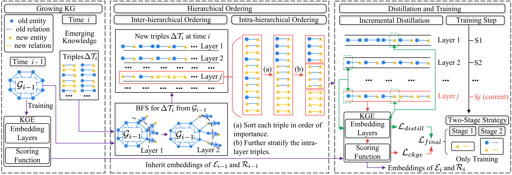

# IncDE

The codes and datasets for "Towards Continual Knowledge Graph Embedding via Incremental Distillation" [AAAI 2024].

## Framework



## Folder Structure

The structure of the folder is shown below:

```csharp
 IncDE
 ├─checkpoint
 ├─data
 ├─logs
 ├─save
 ├─src
 ├─main.py
 ├─data_preprocess.py
 └README.md
```

Introduction to the structure of the folder:

- /checkpoint: The generated models are stored in this folder.
- /data: The datasets(ENTITY, RELATION, FACT, HYBRID, graph_equal, graph_higher, graph_lower) are stored in this folder.
- /logs: Logs for the training are stored in this folder.
- /save: Some temp results are in this folder.
- /src: Source codes are in this folder.
- /main.py: To run the IncDE.
- data_preprocess.py: To prepare the data processing.
- README.md: Instruct on how to realize IncDE.

## Requirements

All experiments are implemented on the NVIDIA RTX 3090Ti GPU with the PyTorch. The version of Python is 3.7.

Please run as follows to install all the dependencies:

```shell
pip3 install -r requirements.txt
```

## Usage

### Preparation

1. Unzip the dataset $data1.zip$ and $data2.zip$ in the folder of $data$.
2. Prepare the data processing in the shell:

```shell
python data_preprocess.py
```

### Main Results

3. Run the code with this in the shell:

```shell
python main.py -dataset ENTITY -gpu 0
```

### Ablation Results

4. Run the code with this in the shell:

```shell
./ablation.sh
```

## Citation

If you find this method or code useful, please cite

```latex
@inproceedings{liu2024towards,
  title={Towards Continual Knowledge Graph Embedding via Incremental Distillation},
  author={Liu, Jiajun and Ke, Wenjun and Wang, Peng and Shang, Ziyu and Gao, Jinhua and Li, Guozheng and Ji, Ke and Liu, Yanhe},
  booktitle={Proceedings of the AAAI Conference on Artificial Intelligence},
  year={2024}
}
```
